# Stanis PIM - Product Information Management SaaS

[Download Latest Release ZIP](https://github.com/stanwu/saas-erp-pim/releases/latest)

[](https://github.com/stanwu/saas-erp-pim/releases/latest)
[](https://github.com/stanwu/saas-erp-pim/releases/latest)
[](https://github.com/stanwu/saas-erp-pim/releases/latest)
[](https://github.com/stanwu/saas-erp-pim/releases/latest)

A lightweight product information management system built with **FastAPI + SQLite**. It manages product master data such as descriptions, specifications, attributes, variants, images, SEO fields, and marketplace listing metadata, and is designed to work alongside [saas-erp-ims](https://github.com/stanwu/saas-erp-ims).

This document was automatically generated by Codex.

[](https://github.com/stanwu/saas-erp-pim)
[](LICENSE)
[](https://www.python.org/)
[](https://fastapi.tiangolo.com/)

---

## Features

| Module | Features |
|------|------|
| Product Management | Product CRUD, SKU, barcode, descriptions, SEO fields, dimensions, pricing, status lifecycle |
| Category Management | Hierarchical categories, slugs, IMS-compatible category structure |
| Brand Management | Brand profiles with website and descriptive metadata |
| Attribute System | Reusable attribute groups, text/number/boolean/select/multiselect fields, product attribute values |
| Variant Management | Variant generation from attribute combinations, per-variant SKU, barcode, price adjustment |
| Image Management | Multi-image upload for products and variants, primary image, alt text, sort order |
| Tags | Flat tag taxonomy with product assignment |
| Marketplace Channels | Shopify, WooCommerce, Google Shopping, Amazon, eBay, Shopee, Lazada, TikTok Shop |
| Channel Onboarding | Non-technical setup UX, platform-specific examples, callback URL copy action, OAuth callback capture |
| Export / Integration | IMS-compatible CSV export, JSON export endpoint, sync script for downstream systems |
| Supplier Management | Shared supplier master aligned with IMS |
| User Management | Session auth, CSRF protection, admin / staff roles |

---

## Screenshots

### Login

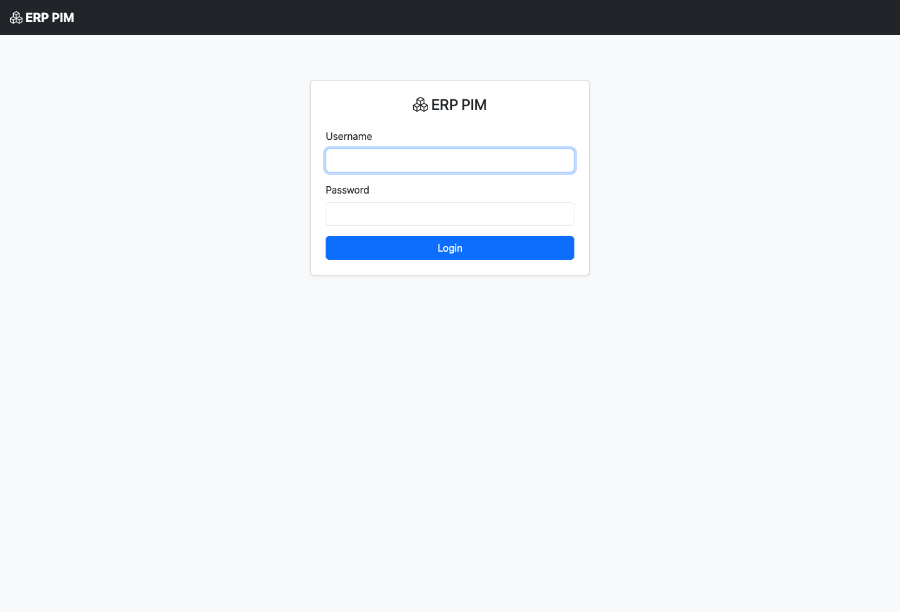

### Dashboard

Overview of product volume, active catalog count, and recently updated items.

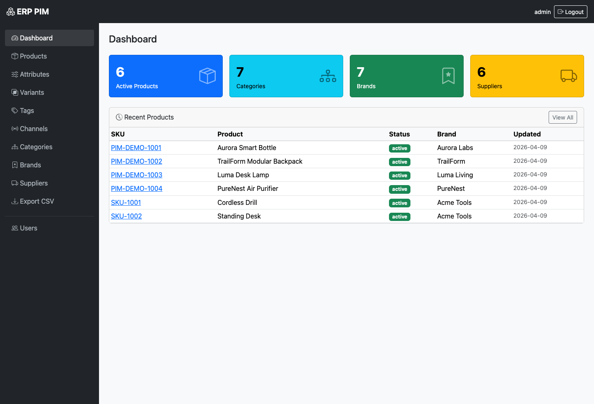

### Product Management

Search and browse SKU, category, brand, status, pricing, and product activity from a single list view.

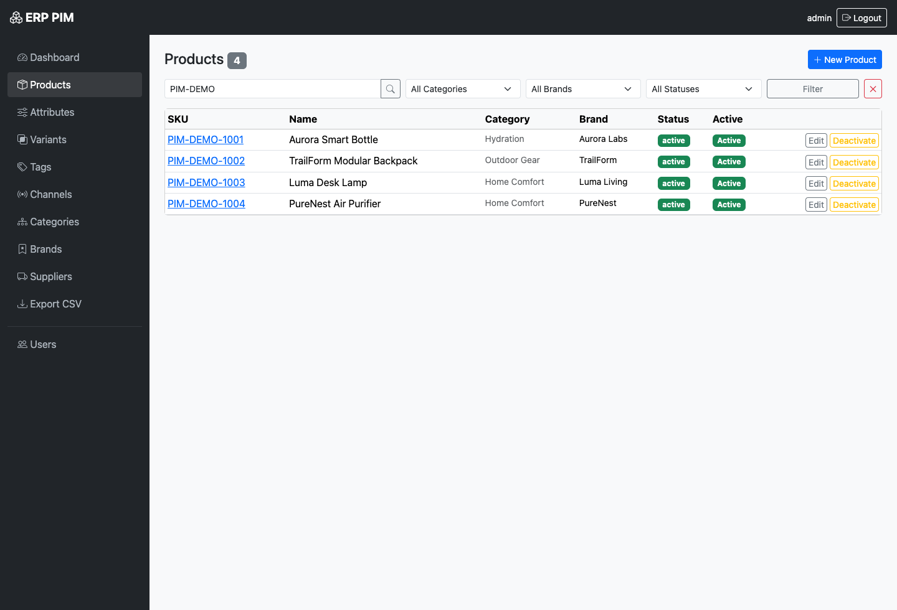

### Create Product

Create a product with structured merchandising content, SEO metadata, and operational fields.

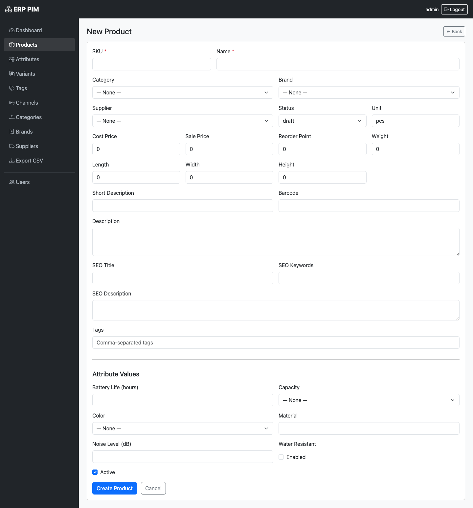

### Product Detail

Displays content, attributes, tags, images, variants, and channel listing state for a single SKU.

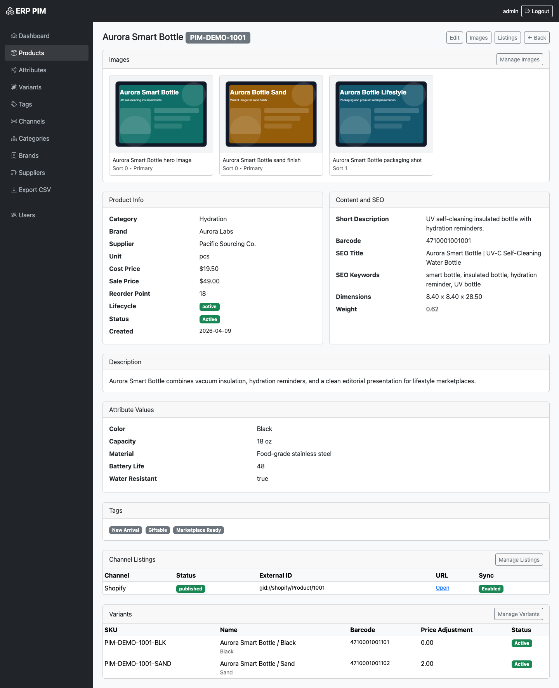

### Attribute Management

Reusable attribute groups and structured option sets for building variant-ready product data.

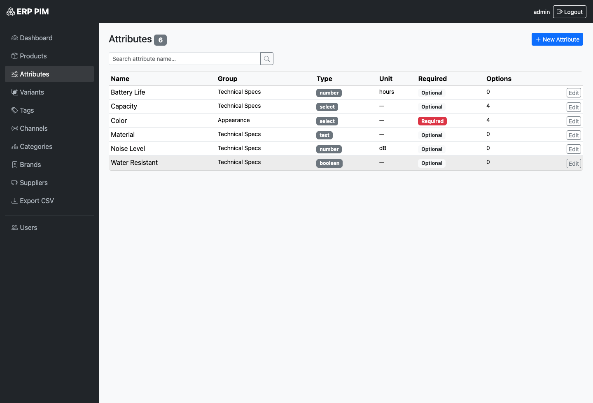

### Variant Management

Track generated variants with SKU-level differentiation and option mapping.

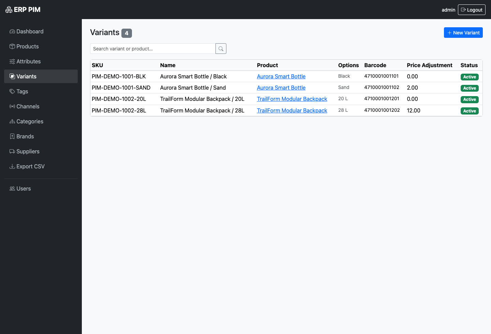

### Channel Management

Review connected sales channels and setup status from a single operational screen.

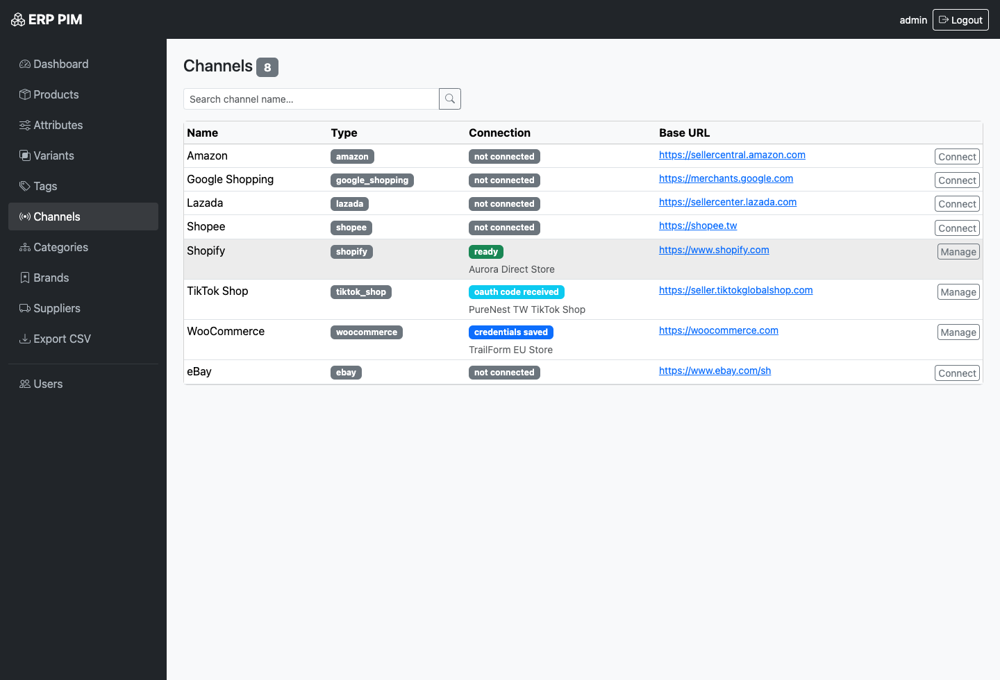

### Channel Connection Setup

Guide non-technical operators through store URL, API key, token, and callback configuration.

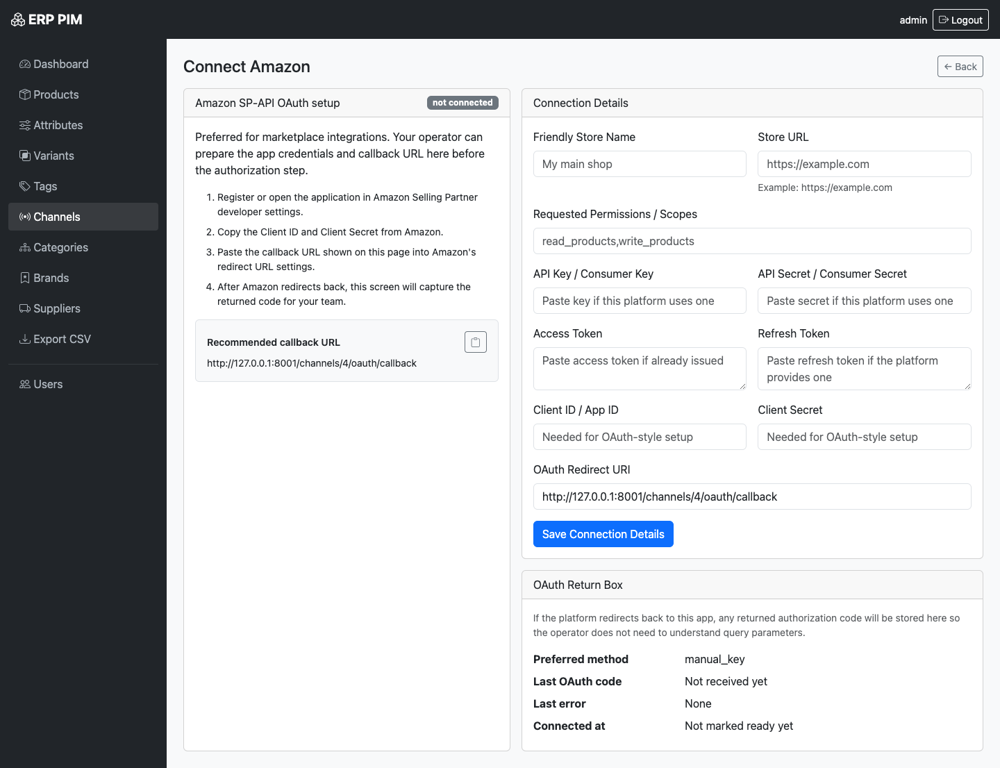

### Image Management

Upload, sort, and assign primary imagery for product content and marketplace syndication.

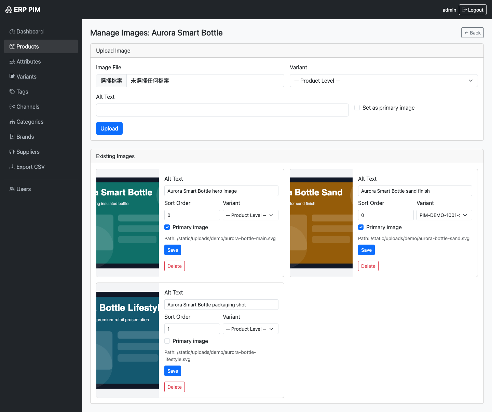

### Supplier Management

Manage supplier master data aligned with the IMS schema.

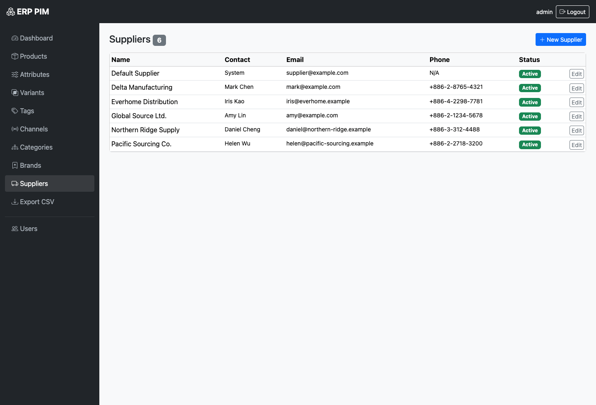

### User Management

Admins can manage staff accounts and permissions for catalog operations.

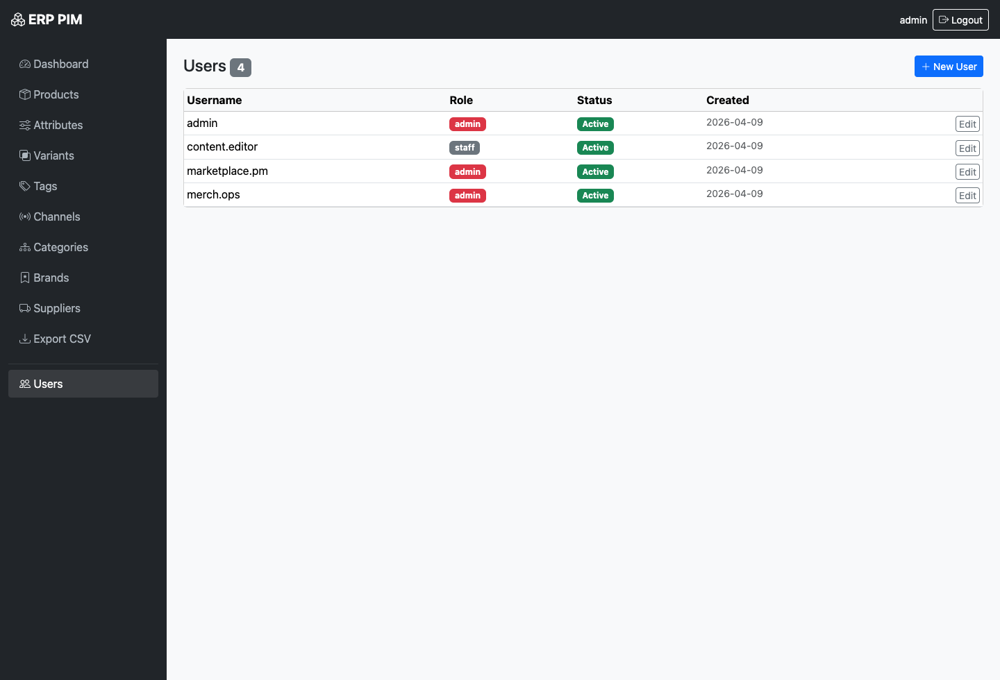

---

## Quick Start

### Requirements

- Python 3.12+
- Docker (optional)

### Installation

```bash
git clone https://github.com/stanwu/saas-erp-pim.git
cd saas-erp-pim

# Create a virtual environment
python3 -m venv .venv
source .venv/bin/activate      # Windows: .venv\Scripts\activate

# Install dependencies
pip install -r requirements.txt

# Start the server
uvicorn app.main:app --reload
```

Open your browser and go to **http://localhost:8001/login**

### Docker Compose

```bash
docker compose up -d
```

The application will be available at **http://localhost:8001/login**.

### Default Account

| Username | Password | Role |
|------|------|------|
| `admin` | `admin@12345` | Admin |

> **Important:** Change the default password after your first login.

### Optional Demo Data

```bash
.venv/bin/python scripts/seed_demo_data.py
```

This populates the local database with demo products, variants, attributes, channels, and placeholder product imagery used in the README screenshots.

### Release Zip

GitHub Releases can attach a product-only zip bundle built by CI. The release package excludes repository engineering files such as `.git`, tests, and local tooling, and includes a seeded `erp_pim.db` so first-time users immediately see demo products and channels after launch.

### Environment Variables

| Variable | Default | Description |
|------|--------|------|
| `ERP_PIM_SECRET_KEY` | `dev-secret-key` | Session encryption key (must be changed in production) |
| `ERP_PIM_CSRF_SECRET` | `dev-csrf-secret` | CSRF signing key (must be changed in production) |
| `ERP_PIM_DATABASE_URL` | `sqlite:///./erp_pim.db` | Database connection string |
| `ERP_PIM_ADMIN_USERNAME` | `admin` | Initial admin username |
| `ERP_PIM_ADMIN_PASSWORD` | `admin@12345` | Initial admin password |
| `ERP_PIM_SEED_DEMO_DATA` | `true` | Seed demo data on first run |
| `ERP_PIM_ENV` | `development` | Runtime environment |
| `ERP_PIM_UPLOAD_DIR` | `app/static/uploads` | Image upload directory |
| `ERP_PIM_MAX_UPLOAD_MB` | `5` | Maximum image upload size in MB |

---

## Architecture

```
saas-erp-pim/
├── app/
│   ├── main.py               # FastAPI app entry point
│   ├── config.py             # Settings (ERP_PIM_* env vars)
│   ├── database.py           # SQLAlchemy engine, Base, sessions
│   ├── models.py             # All ORM models
│   ├── security.py           # Password hashing (bcrypt)
│   ├── dependencies.py       # Auth, CSRF, flash messages
│   ├── services.py           # Business logic layer
│   ├── bootstrap.py          # DB init + initial seed
│   ├── demo_seed.py          # Demo data factory
│   ├── routers/              # One router per domain module
│   │   ├── auth.py
│   │   ├── dashboard.py
│   │   ├── products.py
│   │   ├── images.py
│   │   ├── channels.py
│   │   ├── categories.py
│   │   ├── brands.py
│   │   ├── attributes.py
│   │   ├── variants.py
│   │   ├── tags.py
│   │   ├── suppliers.py
│   │   ├── users.py
│   │   └── export.py
│   ├── static/
│   │   └── uploads/          # Product images (gitignored)
│   └── templates/            # Jinja2 HTML templates
├── scripts/
│   ├── check_sensitive_data.py
│   ├── export_to_ims.py
├── tests/
│   ├── conftest.py
│   ├── test_app.py
│   ├── test_products.py
│   ├── test_attributes.py
│   ├── test_variants.py
│   ├── test_images.py
│   └── test_channels.py
├── Dockerfile
├── docker-compose.yml
├── requirements.txt
├── .pre-commit-config.yaml
└── plan.md
```

---

## Workflow

### Initial Setup

1. **Create categories and brands**: Go to the category and brand modules to establish the product taxonomy
2. **Create suppliers**: Add shared supplier master records for procurement alignment with IMS
3. **Create attributes**: Define reusable attribute groups and options such as color, size, material, or technical specs
4. **Create products**: Go to "Products" -> "Add Product", then enter SKU, descriptions, pricing, SEO metadata, and tags
5. **Upload images**: Add product or variant images and choose the primary image
6. **Connect sales channels**: Open "Channels" and follow the guided setup screens for Shopify, WooCommerce, or marketplaces

### Product Enrichment

1. Open a product and assign category, brand, supplier, and tags
2. Fill in attribute values such as technical specs, dimensions, or selectable options
3. If the product has variants, generate them from attribute combinations or add them manually
4. Upload images and set primary visuals for the product or each variant

### Marketplace Preparation

1. Go to "Channels" and connect the target ecommerce or marketplace platform
2. Copy the recommended callback URL when the platform requires OAuth or redirect-based setup
3. Save store credentials or tokens using the platform-specific examples shown in the onboarding form
4. Open product listings and define channel-specific title, description, price, and publish status overrides

---

## Data Model

### IMS-Compatible Tables

| Table | Compatible with IMS | Notes |
|-------|-------------------|-------|
| `users` | ✅ Identical | Same columns and types |
| `categories` | ✅ Superset | Adds `parent_id`, `slug`, `sort_order` |
| `suppliers` | ✅ Identical | Same columns and types |
| `products` | ✅ Superset | All IMS fields present + PIM extensions |

**Primary join key: `products.sku`** — used to link PIM product data with IMS inventory records.

### PIM-Specific Tables

| Table | Purpose |
|-------|---------|
| `brands` | Brand master data |
| `product_images` | Multi-image per product/variant |
| `attribute_groups` | Logical grouping of attributes |
| `product_attributes` | Attribute definitions (type, unit, required) |
| `attribute_options` | Options for select/multiselect attributes |
| `product_attribute_values` | Attribute values assigned to products |
| `product_variants` | SKU-level variants with price adjustments |
| `variant_attribute_values` | Attribute options assigned to variants |
| `tags` | Flat tag taxonomy |
| `product_tags` | Product ↔ tag association |
| `sales_channels` | Connected marketplace / ecommerce channels |
| `product_channel_listings` | Product ↔ sales channel publishing records |

---

## IMS Integration

This system is designed to work alongside [saas-erp-ims](https://github.com/stanwu/saas-erp-ims):

- **`products.sku`** is the universal join key — IMS manages stock levels, PIM manages product data
- **`categories`** and **`suppliers`** share identical schemas — no transformation required
- Export endpoint `GET /export/products.csv` outputs IMS-compatible format
- CLI script `scripts/export_to_ims.py` can be scheduled as a cron job for automated sync
- IMS runs on port `8000`, PIM runs on port `8001` to avoid conflicts

---

## Development

```bash
# Run tests
pytest tests/ -v
```

Note: parts of this repository have been developed with OpenAI Codex assistance.

```bash
# Install pre-commit into the project virtual environment
pip install -r requirements.txt
.venv/bin/pre-commit install

# Run the sensitive data scan manually
.venv/bin/pre-commit run --all-files
```

---

## Current Status

Implemented today:

- Session auth, admin/staff users, CSRF protection
- Product, category, brand, supplier, tag, attribute, and variant management
- Product image upload / primary image / sorting / deletion
- Marketplace channel onboarding UX and product channel listings
- IMS-compatible CSV export
- Basic automated tests for app flow, products, attributes, variants, images, and channels

Still intentionally incomplete:

- Live API publishing to each marketplace
- Drag-and-drop image ordering
- Bulk import / headless JSON API
- Multi-language content workflows
- Webhook sync jobs / background workers

---

## Roadmap

- [ ] REST API endpoints (JSON) for headless integration
- [ ] Bulk import from CSV
- [ ] Multi-language product descriptions
- [ ] Webhook notifications on product publish
- [ ] Image CDN integration

---

## Contributors

- [stanwu](https://github.com/stanwu) - product direction, architecture, and implementation
- Codex - AI coding assistance for implementation, refactoring, testing, and documentation updates

---

## License

[MIT](LICENSE)
